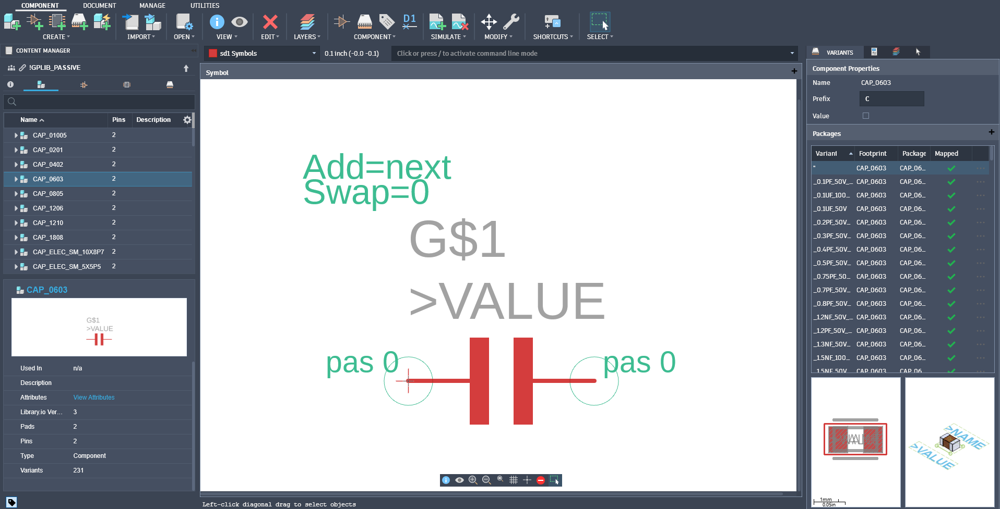
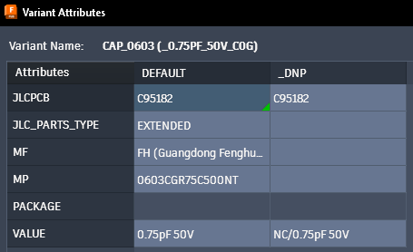

# fusion-libraries

Autodesk Fusion Electronics libraries from Ground Plane Studio, built for boards
assembled at JLCPCB: footprints, symbols and value variants that carry the JLCPCB
part number, manufacturer and part number, plus schematic frames and power symbols.

> **No warranty. Use at your own risk.** These are the libraries we use on our
> own boards, shared as they are, with no warranty of any kind. Parts can be
> wrong: a footprint, a pinout, a rotation, a part number. Check every part
> against its datasheet and JLCPCB's part page before you order boards. Ground
> Plane Studio, LLC is not liable for boards that do not work, scrapped parts,
> rework or any other loss from using these libraries. See
> [DISCLAIMER.md](DISCLAIMER.md) and sections 5 and 6 of the licence. If you
> find a mistake, please open an issue.

## Libraries

| File | Contents | Status |
|---|---|---|
| `!GPLIB_PASSIVE.flbr` | Resistors, capacitors (MLCC, electrolytic), inductors, ferrites, fuses, crystals, transformers, filters: a device per package, a variant per value with its JLCPCB part number (79 device sets, 4,059 variants) | Used on all our boards |
| `!GPLIB_SCHEMATIC.flbr` | Sheet frames (A and B size, title page, contents), about 160 named power rails and 7 ground symbols, and a net tie | Used on all our boards |
| `!GPLIB_ACTIVE.flbr` | Regulators and PMICs, interface ICs, MCUs, modules, memory, sensors, logic, FETs, diodes, TVS, LEDs (196 device sets) | Less checked: verify before use |
| `!GPLIB_CONN.flbr` | Connectors and headers (USB, HDMI, RJ45, FFC, SATA, wire-to-board), switches, terminals, antennas, battery holders, relays (109 device sets) | Less checked: verify before use |
| `!GPLIB_PCB.flbr` | Fiducial, mounting holes, test point, pogo pads, breakaway tab, LED holder | Less checked: verify before use |



## Install

1. Download the `.flbr` files you want from `libraries/` (or the latest release).
2. In Fusion, open the **Data Panel**, pick a project, and **Upload** the files.
3. In a design, open the **Library Manager** and add the libraries from that
   project.

## Conventions

**Names.** A device set per package and family (`RES_0603`, `CAP_0805`); a variant
per value, named after it: `RES_0603_10K_1%_1/10W`, `CAP_0402_100NF_50V_X7R`. Rated
voltages in kV read `1KV` / `2KV`.

**Symbols.** Every two-pin part (resistor, capacitor, inductor, ferrite, fuse,
crystal, diode, LED, TVS) uses the same 7.62 mm symbol, origin on pin 1, with the
anode (or +) on the left for polar parts, so schematics read the same everywhere.

**Attributes** on each variant:



| Attribute | Meaning |
|---|---|
| `VALUE` | The value shown on the schematic |
| `JLCPCB` | JLCPCB / LCSC part number (C-number) |
| `MF`, `MP` | Manufacturer, manufacturer part number |
| `JLC_PARTS_TYPE` | `BASIC` or `EXTENDED` at JLCPCB (when we recorded it) |
| `JLC_FOOTPRINT` | `TRUE` when the footprint is JLCPCB's own (no rotation or offset correction needed); such packages also carry the text `JLC` on layer 114 |
| `JLC-ROTATION`, `JLC-X-OFFSET`, `JLC-Y-OFFSET` | Correction for JLCPCB's pick and place, on some parts only (not maintained or checked: see below) |

Passive variants also have a `_DNP` column (do not populate): the same part with its
`VALUE` prefixed `NC/`, so it shows as not fitted on the schematic and the export
ULP leaves it out of the BOM and CPL.

## JLCPCB part numbers

Every variant in `!GPLIB_PASSIVE` carries the JLCPCB part number (the LCSC
C-number, for example `C25804` for a 10k 0603 resistor) in its `JLCPCB`
attribute, so picking the value in Fusion picks the part JLCPCB will place. Most
parts in the other libraries carry one too. `JLC_PARTS_TYPE` says whether it was a
**basic** part (no setup fee at JLCPCB) or **extended** (a fee per unique part)
when we recorded it.

The passive part numbers were picked from JLCPCB's in-stock components in
September 2026. We refresh them every few months.

Part numbers go stale: parts go out of stock, are discontinued, or move between
basic and extended. Before you order, look up each part number on
[jlcpcb.com/parts](https://jlcpcb.com/parts) (or check the BOM match JLCPCB shows
when you upload it): the part must be in stock and must be the part you meant,
with the right value, tolerance, voltage and package.

To build the BOM JLCPCB wants, export a BOM with the `JLCPCB` attribute as the
"JLCPCB Part #" column (the MCP server's `export_bom` does this for you).

## Exporting the BOM and CPL for JLCPCB

[`ulp/jlcpcb_export.ulp`](ulp/jlcpcb_export.ulp) writes the files JLCPCB's
assembly order asks for, straight from the board:

1. Open the board (not the schematic) in Fusion Electronics.
2. Run the ULP: **Automation > Run ULP** and pick `jlcpcb_export.ulp`, or type
   `RUN 'C:/path/to/jlcpcb_export.ulp'` in the command line.
3. Pick a folder and a file name prefix. It writes:

| File | Contents |
|---|---|
| `<prefix>_BOM.csv` | The BOM to upload: parts grouped by value and footprint, with designators, the `JLCPCB` part number, `MF` and `MP` |
| `<prefix>_PNP.csv` | The placement (CPL) file to upload: designator, X and Y in mm, Top or Bottom, rotation |
| `<prefix>_BOM_excluded.csv`, `<prefix>_PNP_excluded.csv` | Parts left out, with the reason, so you can check nothing was dropped by mistake |

Left out of the BOM and CPL: parts with `_NC` or `TP` in their name, `NC/` in
their value, `MOUNTHOLE` in their name, value or footprint, and test point
footprints (`TEST_POINT`, `TESTPOINT`). Check the excluded files: any
designator containing `TP` is left out, which may catch a part you meant to keep.

Placement uses the part's `JLC-ROTATION`, `JLC-X-OFFSET` and `JLC-Y-OFFSET` where
set (offsets turn with the part and flip for the bottom side), and ignores them on
footprints marked as JLCPCB's own (text `JLC` on the `JLC_FOOTPRINT` layer, 114).
Resistor values keep their ohm sign in the CSV.

## Before you order: check part orientation

JLCPCB's pick and place uses its own footprint for each part, and its idea of
0 degrees is not always the same as the footprint in a library. A part placed
from a CPL that does not account for that comes out rotated or offset. Diodes,
LEDs, electrolytic and tantalum capacitors, ICs and connectors are the ones that
go wrong.

Some parts carry corrections for that (`JLC-ROTATION`, `JLC-X-OFFSET`,
`JLC-Y-OFFSET`, or `JLC_FOOTPRINT=TRUE` where the footprint is JLCPCB's own), but
**orientation is not maintained or checked in these libraries**. Many parts have
no correction, and the ones that do may be out of date or wrong. Treat every
part's placement as unverified, and before you pay for assembly:

1. Upload the gerbers, BOM and CPL, and open JLCPCB's component placement preview
   on the order page.
2. Check every part, one by one: it sits on its pads, and pin 1 or the polarity
   mark lines up with the board's silkscreen.
3. Rotate or move any part that is wrong right there in the preview.
4. Put the same correction on the part in your copy of the library, so the next
   order comes out right.

## With fusion-electronics-mcp

These libraries work with the
[Fusion Electronics MCP server](https://github.com/groundplane-studio/fusion-electronics-mcp):
its BOM and CPL exports read the attributes above (`check_jlc_orientation`
also compares each footprint with JLCPCB's and derives corrections, flagging any
it cannot be sure of), and its block schematics use the frames and power symbols.
It does not replace the placement preview check above. Point it at them with:

```
FUSION_MCP_SHEET_FRAME=FRAME_B_L@!GPLIB_SCHEMATIC
FUSION_MCP_GROUND_SYMBOL=GND_EARTH@!GPLIB_SCHEMATIC
FUSION_MCP_POWER_SYMBOL=12V@!GPLIB_SCHEMATIC
```

Parts these libraries do not have can be built from JLCPCB's own footprints
into a library of your own: see "Your own parts library" in the MCP's README.

## Licence

[CC BY 4.0](LICENSE): use, change and share these libraries, including
commercially, with credit to Ground Plane Studio, LLC. Provided with no warranty:
see [DISCLAIMER.md](DISCLAIMER.md).
